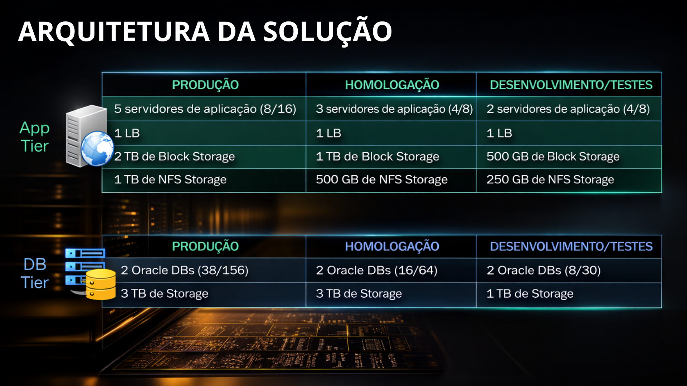

# APRESENTAÇÃO EXECUTIVA: MIGRAÇÃO SAP PARA AWS

## 1. Visão Estratégica

A modernização do ecossistema SAP (PROD, HML e DEV) para a nuvem AWS tem como foco eliminar os gargalos do hardware On-Premises, garantindo alta disponibilidade (SLA de nível Enterprise) e previsibilidade financeira através de práticas de FinOps.

## 2. Arquitetura da Solução

A infraestrutura foi desenhada seguindo as melhores práticas do AWS Well-Architected Framework:

**Pilares Técnicos:**

* **Resiliência:** Banco de Dados RDS Oracle em Multi-AZ para o ambiente de Produção, garantindo failover automático em caso de desastres.
* **Performance:** Instâncias EC2 da família `t3a` (AMD EPYC), oferecendo a melhor relação custo-benefício para cargas de trabalho SAP.
* **Armazenamento Centralizado:** Uso de Amazon EFS para compartilhamento ágil e seguro de arquivos do sistema (`/sapmnt`).

## 3. Análise Financeira e TCO (Total Cost of Ownership)

A transição adota o modelo de **OPEX**, eliminando a compra de ativos físicos (CAPEX). Para maximizar a redução de custos, aplicamos o **Compute Savings Plan de 3 anos**, travando o melhor preço possível.

### 3.1 Custo Consolidado por Ambiente

| Ambiente | Custo Mensal Estimado (USD) | Custo Anual Estimado (USD) |
| :--- | :--- | :--- |
| **Produção (PROD)** | $22.481,52 | $ 269.778,24 |
| **Homologação (HML)** | $9.718,97 | $ 116.627,64 |
| **Desenvolvimento (DEV)** | $7.625,13 | $ 91.501,56 |

### 3.2 Suporte e Garantia Operacional

Para garantir que o core business não sofra interrupções prolongadas, incluímos o **AWS Enterprise Support**.

* **Investimento:** $ 15.000,00 / mês
* **Benefício:** Acesso direto a Cloud Support Engineers com SLA de **15 minutos** para incidentes críticos de negócios.

## 4. Conclusão e Próximos Passos

A migração entrega um ambiente elástico que acompanha o crescimento da empresa. O próximo passo recomendado é a aprovação do orçamento provisionado e o início imediato do deploy do ambiente de Desenvolvimento (DEV) para validação técnica.
